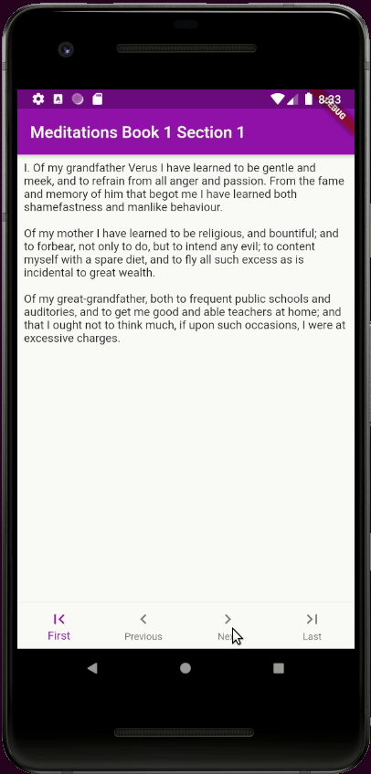

# meditations

A demo Flutter application for reading Meditations by Marcus Aurelius.

## Getting Started

Assume the Flutter commandline is setup, alongside an emulator or a connected dev device, 
you can run the application using the command `flutter run` in the root directory of the repo.

More information on Flutter can be found using the  
[Flutter online documentation](https://flutter.dev/docs).